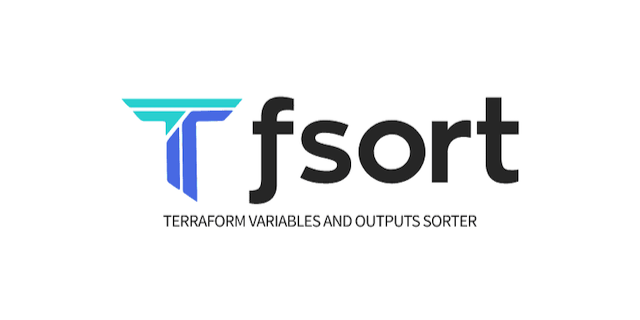

# tfsort

[](https://github.com/AlexNabokikh/tfsort/actions/workflows/ci.yml/badge.svg)
[](https://github.com/AlexNabokikh/tfsort/actions/workflows/release.yml/badge.svg)
[](https://goreportcard.com/report/github.com/AlexNabokikh/tfsort)
[](https://codeclimate.com/github/AlexNabokikh/tfsort/maintainability)
[](https://codeclimate.com/github/AlexNabokikh/tfsort/test_coverage)



`tfsort` is a command-line utility designed for meticulous engineers who prefer to keep their Terraform `variable`, `output`, `locals` and `terraform` blocks sorted alphabetically. It also corrects spacing issues between these blocks and removes leading or trailing newlines in the processed files. `tfsort` can read from files or stdin, write to files or stdout, and process directories recursively.

## Contents

- [Demo](#demo)
- [Key Features](#key-features)
- [Supported File Types](#supported-file-types)
- [Installation](#installation)
  - [Homebrew](#homebrew)
  - [Nix](#nix)
  - [Chocolatey (Windows)](#chocolatey-windows)
  - [Using `go install`](#using-go-install)
  - [Binary Release](#binary-release)
  - [From Source](#from-source)
- [Usage](#usage)
  - [Command Synopsis](#command-synopsis)
  - [Arguments](#arguments)
  - [Flags](#flags)
- [Examples](#examples)
- [Contributing](#contributing)
- [Code of Conduct](#code-of-conduct)
- [Author](#author)
- [License](#license)

## Demo

[](https://asciinema.org/a/5EpZOwIhHnMgCZT9NUx5h8vfN)

## Key Features

- **Alphabetical Sorting**: Sorts `variable`, `output`, `locals` and `terraform` blocks within your HCL files.
- **Flexible Input/Output**:
  - Read from a specific file, directory or standard input (stdin).
  - Overwrite the input file, write to a new file, or print to standard output (stdout).
- **Recursive Processing**: Sort files in an entire directory and its subdirectories.
  - Skips common version control (`.git`) and Terraform utility directories (`.terraform`, `.terragrunt-cache`).
- **Dry Run Mode**: Preview changes without modifying any files.
- **Code Formatting**:
  - Corrects spacing between sorted blocks.
  - Removes unnecessary leading or trailing newlines from the file.

## Supported File Types

`tfsort` processes files with the following extensions:

- `.tf`
- `.hcl`
- `.tofu`

## Installation

### Homebrew

To install `tfsort` using Homebrew:

1. Add the tap:

   ```bash
   brew tap alexnabokikh/tfsort
   ```

2. Install `tfsort`:

   ```bash
   brew install tfsort
   ```

### Nix

```bash
nix-env -iA nixpkgs.tfsort
```

### Chocolatey (Windows)

To install `tfsort` using Chocolatey:

```bash
choco install tfsort
```

### Using `go install`

If you have Go installed and configured, you can install `tfsort` directly using `go install`:

```bash
go install github.com/AlexNabokikh/tfsort@latest
```

This command will download the source code, compile it, and install the `tfsort` binary into your `$GOPATH/bin` or `$GOBIN` directory (make sure this directory is in your system's `PATH`).

### Binary Release

Download the latest binary release for your operating system from the [Releases Page](https://github.com/AlexNabokikh/tfsort/releases).

### From Source

Alternatively, build `tfsort` from source:

1. Clone the repository:

   ```bash
   git clone https://github.com/AlexNabokikh/tfsort.git
   cd tfsort
   ```

2. Build the binary:

   ```bash
   go build .
   ```

   This will create a `tfsort` executable in the current directory.

## Usage

### Command Synopsis

```bash
tfsort [flags] [files...]
```

### Arguments

- `files`
  - Path to Terraform/HCL files (e.g., `variables.tf`)
  - Path to directories to process recursively
  - The character `-` instructs `tfsort` to read input from _standard input (stdin). For example `cat file.tf | tfsort -` will read from stdin.
- If no arguments are provided and stdin is not a pipe, `tfsort` will show the help message.

### Flags

- `-o, --out <path>`:
  - Specifies the path to the output file.
  - If the input is a file and `-o` is not provided, the input file is overwritten.
  - If the input is stdin and `-o` is not provided, the output is sent to stdout.
  - This flag **cannot** be used with `-r, --recursive`.
- `-d, --dry-run`:
  - Previews the changes by printing the sorted content to stdout.
  - No files will be modified when this flag is used.
- `-h, --help`:
  - Displays a comprehensive help message, listing available commands, arguments, and flags with their descriptions.
- `-v, --version`:
  - Displays the installed version of the `tfsort` application, typically including the version number, commit hash, and build date if available.

## Examples

1. **Sort a single file in-place:**
   (Sorts `variable`, `output`, `locals` and `terraform` blocks in `my_variables.tf` and overwrites the file)

   ```bash
   tfsort my_variables.tf
   ```

2. **Sort a single file and write to a new file:**

   ```bash
   tfsort -o sorted_variables.tf my_variables.tf
   ```

3. **Preview changes for a single file (dry run):**
   (Prints the sorted content to the console without modifying `my_variables.tf`)

   ```bash
   tfsort -d my_variables.tf
   ```

4. **Sort content from stdin and print to stdout:**

   ```bash
   cat my_config.tf | tfsort -
   ```

5. **Sort content from stdin and write to a file:**

   ```bash
   cat my_config.tf | tfsort -o sorted_from_stdin.tf -
   ```

6. **Recursively sort files in a directory (in-place):**
   (Sorts all `.tf`, `.hcl`, `.tofu` files in `my_terraform_project/` and its subdirectories, modifying them in-place. Skips `.git`, `.terraform`, `.terragrunt-cache`.)

   ```bash
   tfsort ./my_terraform_project/
   ```

7. **Recursively sort files in a directory (dry run):**
   (Prints what would be changed for each file to the console without modifying them.)

   ```bash
   tfsort -d ./my_terraform_project/
   ```

## Contributing

Contributions are welcome! Please read the [CONTRIBUTING.md](./CONTRIBUTING.md) file for guidelines on how to contribute to this project, including code contributions, bug reports, and feature suggestions.

## Code of Conduct

This project adheres to the Contributor Covenant Code of Conduct. By participating, you are expected to uphold this code. Please read the [CODE_OF_CONDUCT.md](./CODE_OF_CONDUCT.md) file for details.

## Author

This project was created by [Alexander Nabokikh](https://www.linkedin.com/in/nabokih/).

## License

This software is available under the following licenses:

- **[Apache 2.0](./LICENSE)**
